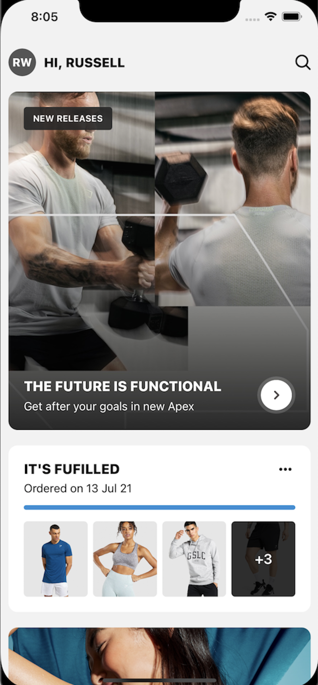

### Introduction

StackKit harnesses the power of [UIStackView's](https://developer.apple.com/documentation/uikit/uistackview) and Swift's [ResultBuilders](https://github.com/apple/swift-evolution/blob/main/proposals/0289-result-builders.md) together. This allows you to easily build declarative UI while only using [UIKit](https://developer.apple.com/documentation/uikit). StackKit is a great solution for anyone looking to level up their programmatic UI without having to convert an existing project to SwiftUI. Its API design is closely matched to SwiftUI making it effortless to pick up without having to accommodate any reactive programming patterns.

## Examples

|                      Feed                      |                      Account                      |
| :------------------------------------------------: | :--------------------------------------------: |
|  |  |

## Why StackKit?

The main advantage StackKit has over a standard programmatic constraints-based approach is maintenance and flexibility. You can quickly change your layout by simply moving the ordering of a couple of views. No more painful rearranging of anchors e.c.t. You can also evaluate conditionals within the UI code, adding boolean properties, loops maps, and more. 

We've made some Example screens and code samples would definitely recommend starting there to grasp how powerful and simplistic StackKit is. We hope to see it in your projects in the near future 🙂

StackKit is built and maintained with love by the Gymshark Engineering Team 💙📱

### Why would you use StackKit instead of SwiftUI

- You still want to use UIKit throughout your app
- Harness the power of building UI like SwiftUI does but your team/project isn’t ready for reactive programming.
- It’s easier to integrate into existing code bases. With SwiftUI you can’t swap a **View** for a **UIView**. This makes it hard to integrate old UI components into SwiftUI.
- SwiftUI hides the underlying view rendering, therefore making it hard to see what is actually going on and refine issues. With StackKit you are still within UIKit so don't lose any abilities.

### Note ⚠️

If you are trying to use StackKit to handle large data sets to replace a UITableView or UICollection view you will run into performance issues. For this usecase you should use [ListKit](https://github.com/gymshark/ios-list-kit) 🦈🗒

## Installation

**Swift Package Manager (SPM)**

To install StackKit using [Swift Package Manager](https://github.com/apple/swift-package-manager) you can follow the [tutorial published by Apple](https://developer.apple.com/documentation/xcode/adding_package_dependencies_to_your_app) using the URL for the StackKit repo with the current version:

\1. In Xcode, select “File” → “Swift Packages” → “Add Package Dependency”

\2. Enter https://github.com/gymshark/ios-stack-kit.git

## Getting Started

StackKit works by extending off of any `UIView`, adding a `UIStackView` to the parents' subview, setting the constraints, and then appending the views to the stack provided to it via the [ResultBuilder](https://github.com/apple/swift-evolution/blob/main/proposals/0289-result-builders.md) This process makes laying out you UI programmatically effortless and because it is simply using [UIStackView](https://developer.apple.com/documentation/uikit/uistackview) underneath, all of the same layout logic still applies. 

If you haven't used UIStackView's before or need a refresher, I highly recommend checking out this [article](https://www.raywenderlich.com/2198310-uistackview-tutorial-for-ios-introducing-stack-views). Result builders are also key to the power of StackKit as well as SwiftUI. To get a better understanding of them check out this [article](https://www.swiftbysundell.com/articles/deep-dive-into-swift-function-builders/). They are awesome 🔥.

With StackKit there are 4 main types of Stacks that you can use. VStack, HStack, VScroll and HScroll. Here are some common code examples below to help you get started with StackKit by extending off your UIView's.

#### UIViewController

---


```swift
func viewDidLoad(){
  view.VStack {
    avatar
    displayName
    friendStatus
    Spacer() // Fills rest of space
  }
}
```

---

#### UIView

---


```swift
class ProfileView: UIView {
  init(){
    HStack {
      avatar
      displayName
      friendStatus
    }
  }
}
```

---

## Stack's within stack's... ([Stackception](Assets/stackwithinastack.png) 🤯)

Above you can see how extending off a UIView and placing UIView items within a Stack is a relatively straightforward process. But what about putting a stack within a stack? Because our result builder is expecting type is a UIView, we can simply pass in another Stack which inturn also excepts UIViews. But, for this, we need to use a Class variant of the Stack instead of extending off of a UIView. Thankfully this is all taken care of and you don't need to do anything differently. Here is a nice example of stacks within stacks.

---


```swift
class ProductsView: UIView {
  init(){
      HStack {
        VStack {
            title1
            product1
            HStack {
                statusIcon1
                statusLabel1
            }
            orderButton1
        }
        VStack {
            title2
            product2
            HStack {
                statusIcon2
                statusLabel2
            }
            orderButton2
        }
    }
  }
}
```

## Layout and customisation 

You might be asking but how do I control the layout, what about sizing constraints and setting spacing and padding. Don't worry we have you covered. 

📝 Note: StackKit comes with a handy repo called [ConstraintsKit](https://github.com/gymshark/ios-constraint-kit). It makes writing Anchors, CGSize, UIEdgeInsets far easier with less boilerplate and some nice little extensions.

### Advanced stack layout 

To have greater control over how a particular Stack handles the layout of its views you can access its `alignment` and `distribution` properties by chaining off the Stack. You can find out more about how to best utilize these properties for your specific needs in these articles.

• https://www.hackingwithswift.com/example-code/uikit/what-are-the-different-uistackview-distribution-types
• https://www.raywenderlich.com/2198310-uistackview-tutorial-for-ios-introducing-stack-views

```swift
VStack {
  displayName
  
  VStack {
    bioLabel 
    HStack { 
      skills.compactMap({ SkillView(skill: $0) }) 
    }.distribution(.fillEqually)
    .alignment(.top)
  }
  
  prices.compactMap({ SkillView(skill: $0) }) 
  Spacer()
  
}.distribution(.fill)
.alignment(.center)
```

### Spacing 

At some point, you will want to provide some spacing between your items. Thankfully with UIStackViews this is simple. We can chain off the specific stack using the `.spacing` function. As well as this we can also add some unique spacing in places where required using the `Spacing` class. It's worth noting that you will want to use this class when you would like the remaining area in a Stack to be taken up by an empty view.

---


```swift
VStack {
  displayName
  tagline
  favouriteColor
  Spacer(h: 10)
  
  HStack {
    skills.compactMap({ SkillView(skill: $0) }) 
  }.spacing(150)
  
 Spacer(h: 20)
 
 seporator
 
 Spacer()
}.spacing(5)

```

---

### Margin 

Applying padding around a stack is made a lot easier with UIStackViews `layoutMargins` which takes a UIEdgeInset property. To use this with your stack you can just chain off the stack again using the `.margin()` function. This provides a great way of giving spacing around views without lots of complex layout code.

---


```swift
VStack {
  displayName
  tagline
  favouriteColor
  Spacer(h: 10)
  HStack {
    skills.compactMap({ SkillView(skill: $0) }) 
  }.spacing(5)
  .margin(.horizontal(10))
  
 Spacer()
}.margin(.init(top: 20, left: 10, bottom: 20, right: 10)

```

---

### Sizing 

Sizing of views can still be achieved using standard NSLayout anchors width and height. Although we prefer to use some handy extensions to make this a lot easier from [ConstraintsKit](https://github.com/gymshark/ios-constraint-kit). Simply chain off any view you want to apply an explicit size to using `.with()` notation. You will notice we have width, height, and square extensions available. Because we are using stacks you don't need to worry about your other views. They will expand and contract where needed. You can even apply sizing to your stacks if you wish to.

---


```swift


VStack {

  displayName.withHeight(120)
  
  profilePicture.withSquare(150)
  
  footer.withSize(w: 300, h: 150)
  
}.alignment(.center)
.margin(.all(20)


```

---


## Use of result builders

With the power of result builders, we can also add conditional parameters and add things such as compact maps and for loops easily. This makes writing coding features a little bit easier. Some use cases might be, Feature Toggling, Hiding Views, easily applying arrays to the stacks. 

---

```swift
VStack {
  if premiumUser {
    PremiumBadge(name: "Russell")
  }
  
  userInfo.map({
    UserTag(text: $0)
  )}
  
  HStack {
    (0..10).map { (id: Int) in
        NumberView(number: id)
    }
  }

}.alignment(.center)


```

---


